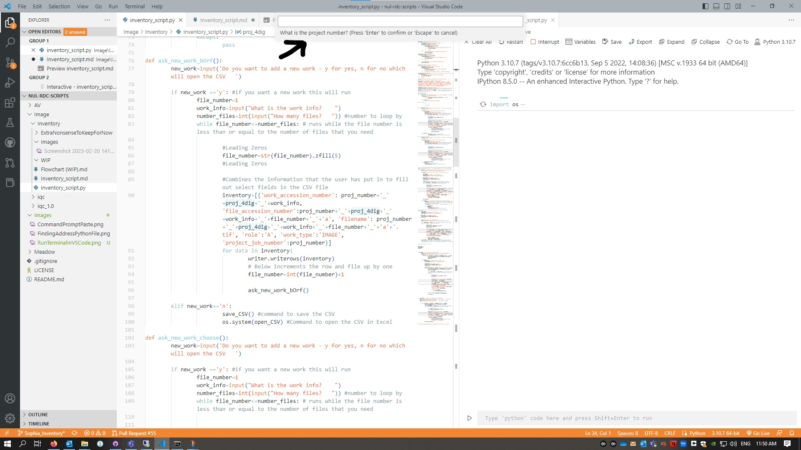

# General Information
Version Date: 2/27/2023

Document Owner: Sophia Francis
Hardware Used: N/A
Software Used: Command Line (Optional), VSCode (Optional), Python, Excel
Location: RDC offices

Description:
This document provides information about running the inventory script, updating certain variables if needed, key of variable names, and example user cases for reference.


# Running the Script
## Running in Command Line
 1. In the search bar of your computer search for Command Prompt and select it
 2. Copy the address of inventory_script.py by right clicking on the script, going to properties, double clicking the address to highlight it and copying (Figure 1)
 3. Paste the address into the Command Prompt window (Figure 2) and press enter
 4. Answer the questions that appear

 
    Figure 1
    
 
    Figure 2

## Running in VSCode Terminal
1. With VSCode open, open the inventory_script.py file
2. Select the little carrot next to the triangle in the upper right corner (Figure 3) and select 'Run Python File'
3. A pop up terminal window will open, follow the prompts given


    Figure 3

## Running in VSCode Interactive Window
1. Follow the same directions in VSCode Terminal option, but select 'Run Python File in Interactive Window' 
2. A pop up window at the top of the page will give you prompts, answer them in the box below the prompt (Figure 4)


    Figure 4

# Helpful Tips
In order to **_change the number of leading zeros_**, find zfill and change the number within the parenthese to how many digits you want the number to have. 

For example:
```zfill(4)``` means that any number that you want to have leading zeros will always have to have 4 digits. So, 6 would become 0006; 14 would become 0014; 245 would become 0245; and 5462 would stay the same.


In order to **_change from inventorying access files to preservation files_**, find ```'role':'A'``` and replace it with ```'role':'P'```. After replacing that part, find ```file_number+''+'a'``` and replace it with ```file_number+''+'p'```

In order to **_change the length of the project number_**, find ```project_number_leng !=5``` and change the 5 to whatever you need. 
* **Make sure to update the print() questions to match this change**. <br>
* **Make sure to add one digit for the 'p' so p0115 would require five digits**.
# Key to Variables


|Variable|Value|
|:--:|:--:|
|ask_new_work_bOrf|Asks whether or not you want to add a Box or a Folder to your project if you are running the Box/Folder option|
|ask_new_work_choose|Asks whether or not you want to add a new work if you are running the choose your own adventure option| 
|ask_new_work|Asks if you want to add a new work to the inventory|
|ask_projnum_again|Asks what the project number is again if originally entered incorrectly|
|box_number|Based on user input for the box currently working on. Only shows for Box/Folder option.
|box_other|Asks whether or not you are using the box/folder designation or the choose your own adventure route|
|csv_name|Variable that sets the name of the CSV based on the user input|
|field_names|Gives the headers for each of the columns|
|file_number|Counts the number of the file that is being created by the script. Is incremented by one each time the loop runs|
|file_path|Variable for the location where you want to save the CSV file|
|folder_files|The total number of files to write. This provides the loop for 'x' number of times run this code|
|folder_number|Based on user input for the folder currently working on|
|new_bOrf|Asks whether or not you want to add a new box or folder|
|new_work|Asks whether or not your want to add a new work|
|os.system|Calls the os.system of your computer -- this is how it knows to open Excel|
|page_number|Counts number of pages (similar to file_number). Increments up by one after each loop. Only shows when running the choose your adventure route|
|pages|Based on user input for the page currently working on. Only shows when running the choose your own adventure route|
|pages_yn|Asks whether or not you want to add a work that uses page designations|
|proj_name_check_again|Asks and checks the project name is if was originally entered wrong|
|proj_name_leng|Length of the project name|
|proj_number|Project Number (ex. p0386)|
|proj_number_leng|Length of the project number|
|proj_P_TF|If project number has a 'p' prefix (True or False - Boolean)


# Filenaming
## Box/Folder
```
<project info>+<work info>+<image number>+<part*>+<role>.tif
```
\* Part is only present for when a digitizers has a work that will require the retention of multiple preservation files per image number (i.e. stitching pieces)

## Choose Your Own Adventure
```
<project info>+<4 letter id>+<work number>+<image number>_a.tif
```

